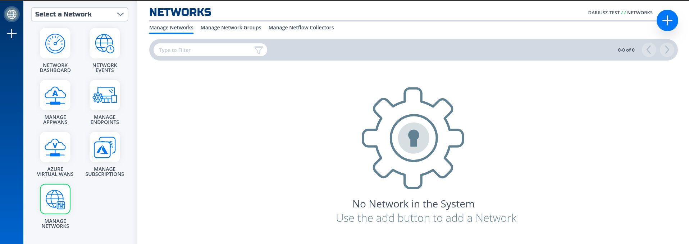
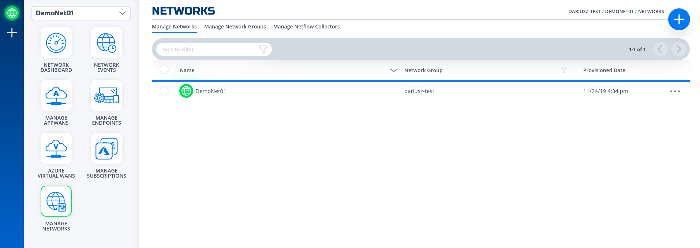

## Create a new network fabric
This section will show how to do that through [NF Console](https://nfconsole.io)

# [via Console UI](#tab/create-fabric-ui)
1. Click on Network Menu
1. Click on "+" button in the top right corner to create a network
1. Give it a name, e.g. "DemoNet01"

4. Wait until the icon network turns green.

# [via REST API (Python)](#tab/create-fabric-python)
***
